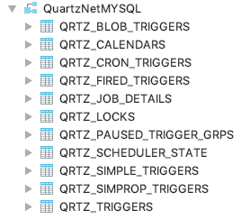
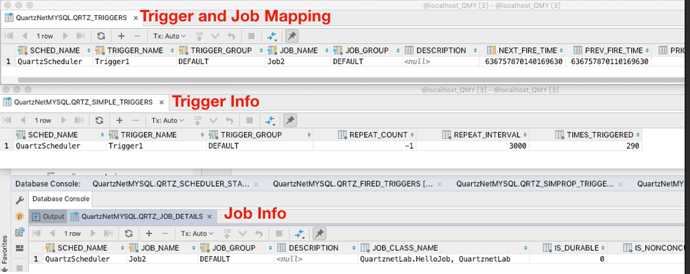

#ASP.NET Core Using QuartzNET介紹 #
---
- 目前QuartzNET 3.x 有支援到 .NET Standard 2.0
- 三大元件
    - Scheduler
        - 排成器
    - Job
        - 執行動作
    - Trigger  
        - 觸發器 
       

-  簡單範例
    1. 建立Scheduler
        ```csharp
            IScheduler scheduler = StdSchedulerFactory.GetDefaultScheduler();`
        ```
    2. 建立Job
        ```csharp
            var job = JobBuilder.Create<HelloJob>().Build();
        ```
    3. Job內容需實作IJob

        ```csharp
            class HelloJob : IJob
            {
                void IJob.Execute(IJobExecutionContext context)
                {
                    Console.WriteLine("Hellow JOB");
                }
            }
        ```

    4. 建立Trigger

         ```csharp
            var trigger = TriggerBuilder.Create()
                .WithSimpleSchedule(x =>
                x.WithIntervalInSeconds(3).RepeatForever())
                .Build(); //每三秒執行一次
        ```
        
    
    5. 註冊Job以及Trigger到Scheduler
      
        ```csharp
            var scheduler.ScheduleJob(job, trigger); //註冊Job 以及Trigger 到 Scheduler
        ```
    
    6. 開啟Scheduler 
        ```csharp
            scheduler.Start();
        ```
- Job 其他註冊方式
    - 給予Job名稱
    - 在scheduler搭配trigger註冊
    ```csharp
        var job1 = JobBuilder.Create<HelloJob>().WithIdentity("Job1")
        var trigger = TriggerBuilder.Create().StartNow().ForJob("Job1").Build();
        await scheduler.AddJob(job1, true);
        await scheduler.ScheduleJob(trigger);
    ```


- Trigger週期
    - 每天某一個時間點
        ```csharp
            var dinnerTime = DateBuilder.TodayAt(14, 33, 50);//每天14點33分50秒是晚餐時間
            var trigger = TriggerBuilder.Create()
                .WithSimpleSchedule().StartAt(dinnerTime).Build();
        ```
    - 有週期性
        - 使用Cron-Experssions 
        ```csharp
        var trigger = TriggerBuilder.Create() //每週四15點12分30秒Tigger
                .WithCronSchedule("30 12 15 ? * THU").Build();
        ```

- Listener
    - 建立Listener
    ```csharp
        public class MyJobListener :IJobListener
        {
            public Task JobToBeExecuted(IJobExecutionContext context, CancellationToken cancellationToken = new CancellationToken())
            {
                //執行前
                Console.WriteLine("before");
                return Task.Delay(0);
            }

            public Task JobExecutionVetoed(IJobExecutionContext context, CancellationToken cancellationToken = new CancellationToken())
            {
                
                return Task.Delay(0);
            }

            public Task JobWasExecuted(IJobExecutionContext context, JobExecutionException jobException,
                CancellationToken cancellationToken = new CancellationToken())
            {
                //執行前
                Console.WriteLine("after");
                return Task.Delay(0);
            }
        }
    ```
      
    - 註冊Listener
        - Listener可以設定Job在執行前後自訂想要的行為

    ```csharp       
        scheduler.ListenerManager.AddJobListener(
                  new MyJobListener(), KeyMatcher<JobKey>.KeyEquals(new JobKey("Job1")));
    ```     
     - 搭配API Pause Job 跟 Resume Job
        - 這邊示範三個方法, Get All Jobs, Pause Job, Resume Job
       ```csharp
        // GET
        [HttpGet]
        public async Task<IReadOnlyCollection<JobKey>> Get()
        {
            IScheduler scheduler = await StdSchedulerFactory.GetDefaultScheduler();
            
            JobDetailImpl jobDetail;
            var allJobDetails = new List<JobDetailImpl>();
            
            var allJobKeys = await scheduler.GetJobKeys(GroupMatcher<JobKey>.AnyGroup());
            
            return allJobKeys;
        }

        [Route("PauseJob")]
        [HttpPost]
        public async Task<string> PauseJob(string jobName)
        {
            IScheduler scheduler = await StdSchedulerFactory.GetDefaultScheduler();
            var jobKey = new JobKey(jobName);
            await scheduler.PauseJob(jobKey);
            return $"{jobName} already Paused.";
        }

        [Route("ResumeJob")]
        [HttpPost]
        public async Task<string> ResumeJob(string jobName)
        {
            IScheduler scheduler = await StdSchedulerFactory.GetDefaultScheduler();
            var jobKey = new JobKey(jobName);
            await scheduler.ResumeJob(jobKey);
            return $"{jobName} already Resume.";
        }
        ```


- 將設定儲存到資料庫(MY-SQL)做持久化
    - install nuget package MySql.data
    - 建立資料庫schema (參考GitHub https://github.com/quartznet/quartznet/blob/master/database/tables/tables_mysql_innodb.sql)
  
    


    - 參數設定
        ```charp
            //1.首先创建一个作业调度池
            var properties = new NameValueCollection();
            //存储类型
            properties["quartz.jobStore.type"] = "Quartz.Impl.AdoJobStore.JobStoreTX, Quartz";
            //表明前缀
            properties["quartz.jobStore.tablePrefix"] = "QRTZ_";
            //驱动类型
            properties["quartz.jobStore.driverDelegateType"] = "Quartz.Impl.AdoJobStore.MySQLDelegate, Quartz";
            //数据源名称
            properties["quartz.jobStore.dataSource"] = "myDS";
            //连接字符串
            properties["quartz.dataSource.myDS.connectionString"] = "Server=localhost; Port=3306; Database=QuartzNetMYSQL;Uid=root;Pwd=pass.123";            
            //版本
            properties["quartz.dataSource.myDS.provider"] = "MySql";
            properties["quartz.serializer.type"] = "json";
            var schedulerFactory = new StdSchedulerFactory(properties);
            var scheduler = await schedulerFactory.GetScheduler();
        ```
    - 將程式跑起來可以看到DB 相關的table 已經有資料


    
- QuarzNET fail over 的功能
    - 參數設定
        ```
                properties["quartz.jobStore.clustered"] = "true"; //開啟clustered
                properties["quartz.scheduler.instanceId"] = "1"; //每一台排成器需要設定不同的Id
                properties["quartz.scheduler.instanceName"] = "IAMQ"; //每一台排程器需使用相同的名字
        ```
    - 預設7.5秒會自動fail over

- 參考來源


1. https://www.quartz-scheduler.net/documentation/quartz-2.x/tutorial/crontriggers.html

2. https://hk.saowen.com/a/f9537f731b4b8d2d7dd24f6f769f9ffb7a4199a98d0841750ba7639366c72bf6

3. https://www.quartz-scheduler.net/documentation/quartz-3.x/tutorial/jobs-and-triggers.html

4. https://www.quartz-scheduler.net/documentation/quartz-3.x/tutorial/crontriggers.html

5. https://www.quartz-scheduler.net/documentation/quartz-3.x/tutorial/crontrigger.html

6. https://www.freeformatter.com/cron-expression-generator-quartz.html
7. https://www.cnblogs.com/yaopengfei/p/8577934.html
8. https://www.cnblogs.com/xingbo/p/5498150.html
